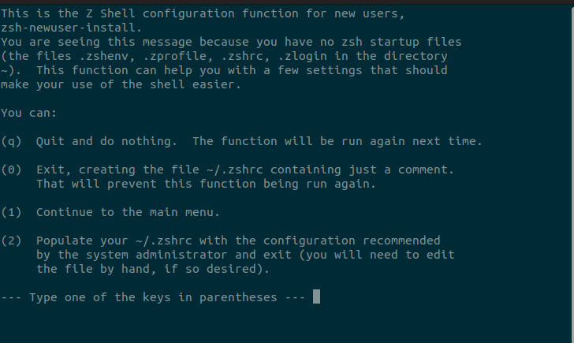
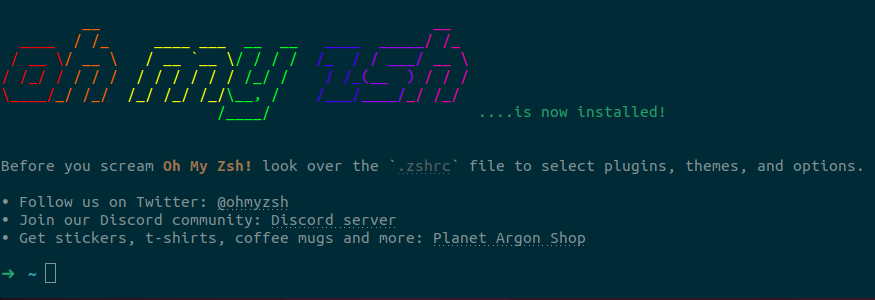

1. Install zsh

   ```sh
   sudo apt install zsh -y
   ```

2. Check your default shell

   ```sh
   echo $0
   ```

3. It should print your default shell. If it's not zsh, then change it to zsh.

   ```sh
   chsh
   ```

4. Enter your password and type .

   ```
   /bin/bash
   ```

5. Reboot your system or **logout and login again**.

   ```sh
   reboot now
   ```

6. Open the terminal, you will see a screen like this

   

7. Choose the proper options. I choose 2.

8. Verify your zsh installation

   ```sh
   echo $0
   ```

   I should say **zsh**.

---

9.  Installing oh-my-zsh

    1.  Install curl or wget, if you don't have it.

    ```sh
    sudo apt install curl -y
    ```

    ```sh
    sudo apt install wget -y
    ```

    2. Install git if you don't have it.

    ```sh
    sudo apt install git -y
    ```

    3. Install oh-my-zsh

    - With curl

    ```sh
    sh -c "$(curl -fsSL https://raw.github.com/ohmyzsh/ohmyzsh/master/tools/install.sh)"
    ```

    - With wget

    ```sh
       sh -c "$(wget https://raw.github.com/ohmyzsh/ohmyzsh/master/tools/install.sh -O -)"
    ```

    After this your terminal will look like this

    

---

10. Installing **powerlevel10k**

    1. Github Repo: [https://github.com/romkatv/powerlevel10k](https://github.com/romkatv/powerlevel10k)
    2. In the terminal, enter the following command

       ```sh
       git clone --depth=1 https://github.com/romkatv/powerlevel10k.git ${ZSH_CUSTOM:-$HOME/.oh-my-zsh/custom}/themes/powerlevel10k
       ```

    3. Install the required fonts

       > Note:You should clone this repo and then run this command. Required fonts are in the fonts folder of this repository.

       ```sh
       mkdir ~/.fonts
       cp -r ./fonts/* ~/.fonts/
       ```

    4. Install gnone-tweak-tool

       ```sh
       sudo apt install gnome-tweaks -y
       ```

    5. Open gnome-tweak-tool

       ```sh
       gnome-tweaks
       ```

    6. Go to **Fonts**.
    7. For Monospace Text, Select **MesloLGS NF Regualar** as your default font.
    8. Close and Open the terminal again.
    9. Open the `~/.zshrc` file with a any file editor.

       ```sh
       nano ~/.zshrc
       ```

    10. Change the theme to powerlevel10k

        ```sh
        ZSH_THEME="powerlevel10k/powerlevel10k"
        ```

    11. Save the file and close it.
    12. Restart the terminal.

---

11. To set up the powerlevel10k theme, open the terminal and follow the instructions.
12. Congratulations, its done. You have successfully installed zsh and powerlevel10k theme.
